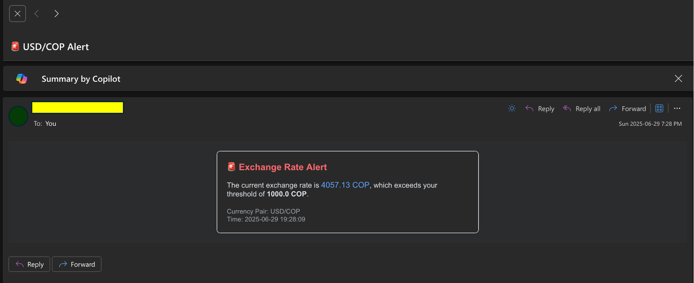

> [!IMPORTANT]
> This project currently uses the **free tier** of [ExchangeRate-API](https://www.exchangerate-api.com/), which may have limitations.

# 📊 Exchange Alert Automation

A Python-based automation tool that checks the daily **USD to COP exchange rate** (or any pair you configure) and **sends an email alert** if the rate exceeds a specified threshold.  
Ideal for freelancers, travelers, or anyone monitoring currency fluctuations.

---

### ✉️ Email Notification Preview

Below is a sample email generated by the system:



It clearly shows the **base currency** (e.g., USD) and the **target currency** (e.g., COP), along with the current exchange rate and timestamp.

---

## 🚀 Features

- 📈 Fetches real-time exchange rates from [ExchangeRate-API](https://www.exchangerate-api.com/)
- 📨 Sends email notifications via SMTP when your defined threshold is exceeded
- 🕒 Automatically runs **once per day**
- 🧱 Built with a clean and modular **OOP architecture**
- 🔐 Uses environment variables through `.env` for secure configuration
- 🪵 Logs exchange rate activity and errors to a local file

---

## 📦 Requirements

- Python 3.8+
- Install dependencies:

```bash
pip install -r requirements.txt
```

**Dependencies:**
```
requests
schedule
python-dotenv
```

---

## ⚙️ Setup

### 1. Clone the Repository

```bash
git clone https://github.com/Harold2828/ExchangeAlert.git
cd ExchangeAlert
```

### 2. Configure Environment Variables

Create a `.env` file in the root directory:

```ini
# Exchange Alert Configuration
EXCHANGERATE_API_KEY=your_api_key_here
EXCHANGERATE_BASE_CURRENCY=USD
EXCHANGERATE_TARGET_CURRENCY=COP
THRESHOLD=4200

# SMTP Configuration
EMAIL_HOST=smtp.gmail.com
EMAIL_PORT=587
EMAIL_SENDER=you@example.com
EMAIL_PASSWORD=your_app_password
EMAIL_RECIPIENT=recipient@example.com

# Runtime Configuration
RUN_TIME=09:00
```

> 🔐 **Important:** Never commit this file. Use secure tools to manage secrets in production.

---

### 3. Gmail App Password Setup (If Using Gmail SMTP)

If your email uses Gmail with 2FA enabled, you must create an **App Password**:

#### 🔐 Steps:

1. Visit: https://myaccount.google.com/
2. Navigate to **Security** → Enable **2-Step Verification** if not yet enabled.
3. Go to: https://myaccount.google.com/apppasswords
4. Select:
   - App: **Mail**
   - Device: **Other (e.g., Exchange Alert)**
5. Generate and copy the 16-character password.
6. Paste it into your `.env` as `EMAIL_PASSWORD`.

> ❗ Do **not** use your regular Gmail password — it will fail with a `534` error.

---

### 4. Run the Script

```bash
python main.py
```

- ✅ Checks the current exchange rate immediately
- ✅ Sends an email alert if the rate exceeds your threshold
- 🕒 Then waits and reruns daily at the specified `RUN_TIME`

---

## 📁 Project Structure

```
exchange_alert/
├── config.py
├── exchange_rate_service.py
├── email_notifier.py
├── exchange_monitor.py
├── scheduler.py
├── main.py
├── .env
├── exchange_alert.log
└── assets/
    └── screenshot_email.png
```

---

## 🛠️ Customization

| Variable                     | Description                                 |
|-----------------------------|---------------------------------------------|
| `THRESHOLD`                 | Exchange rate to trigger the alert          |
| `RUN_TIME`                  | Daily execution time (e.g., `09:00`)         |
| `EXCHANGERATE_BASE_CURRENCY` & `TARGET_CURRENCY` | Currency pair to monitor |
| `EMAIL_*`                   | Email credentials and recipient settings     |

---

## 🧪 Testing Tip

To test email alerts manually:

1. Set `THRESHOLD=1` in `.env`
2. Run:

```bash
python main.py
```

---

## 🔒 Security Notes

- `.env` and `*.log` are excluded via `.gitignore`
- For production, consider using secure email services like **SendGrid** or **Mailgun**